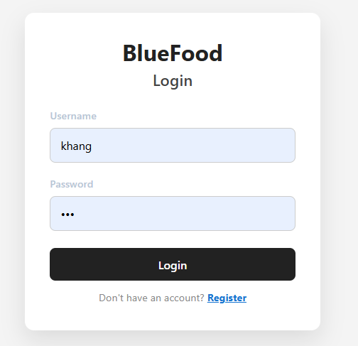
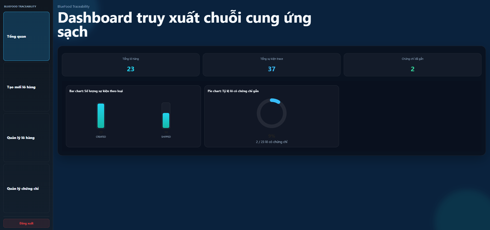
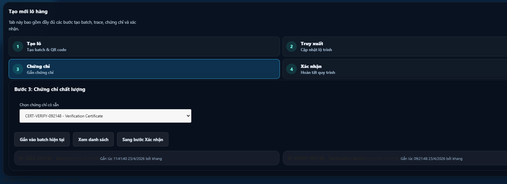
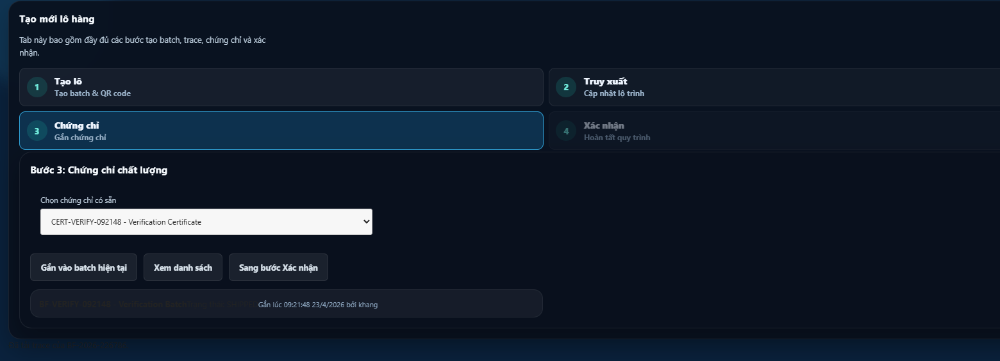
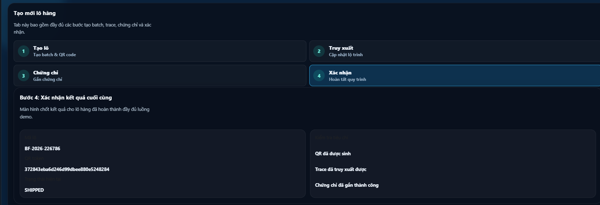
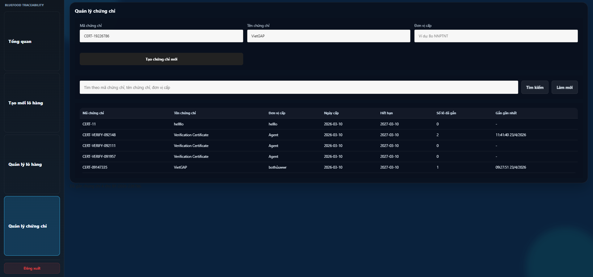
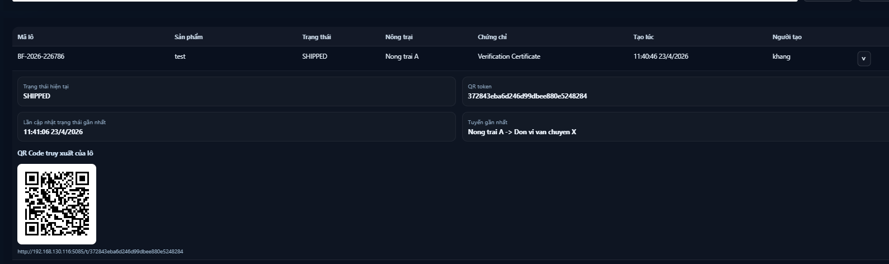
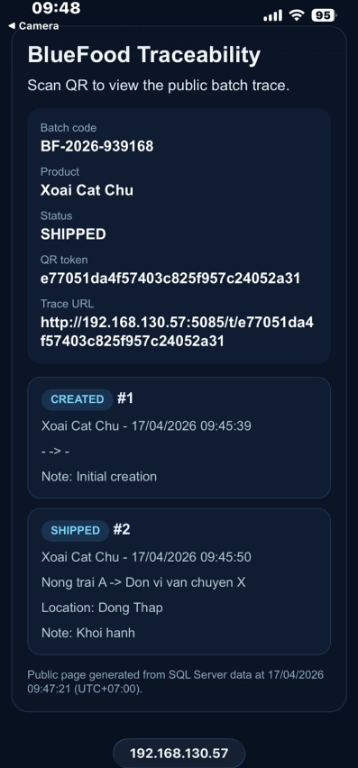

# BlueFood Frontend

Frontend React + TypeScript cho hệ thống truy xuất nguồn gốc BlueFood.

## Chức năng chính
- Dashboard tổng quan
- Tạo lô hàng, sinh QR
- Cập nhật truy xuất (trace)
- Gắn chứng chỉ
- Quản lý lô hàng
- Quản lý chứng chỉ
- Trang truy xuất công khai theo QR

## Giao diện mẫu

### Đăng nhập


### Đăng ký


### Dashboard


### Tạo lô hàng


### Truy xuất lô hàng


### Gắn chứng chỉ


### Xem danh sách chứng chỉ đã gắn


### Xác nhận lô hàng


### Quản lý lô hàng


### Quản lý chứng chỉ


### Xem chi tiết lô hàng


### Thông tin lô từ quét mã QR, lưu ý máy chạy demo với điện thoại quét phải cùng chung wifi


## Cài đặt & chạy
```bash
npm install
npm run dev
```

- Mặc định chạy tại: http://localhost:5173
- Đổi API backend: sửa file `.env`

## Build production
```bash
npm run build
npm run preview
```

## Thông tin thêm
- Hiển thị thời gian theo giờ Việt Nam (UTC+07:00)
- Đồng bộ với backend BlueFood (API: http://localhost:5085)
- Nếu chạy frontend ở domain/port khác, cần cấu hình lại CORS backend.
