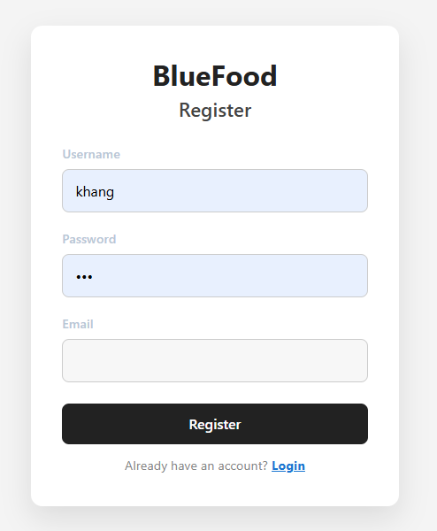
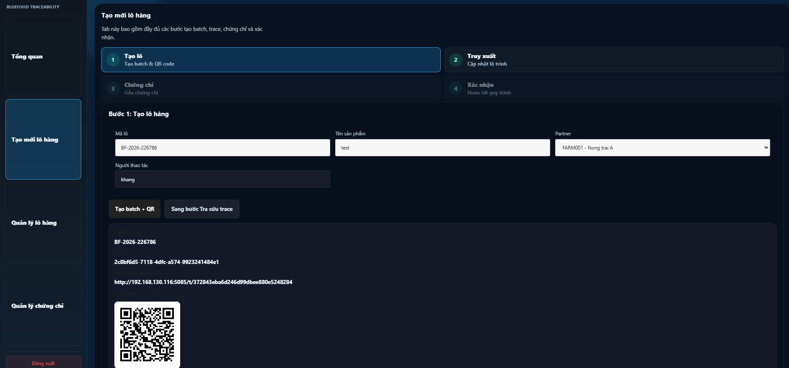
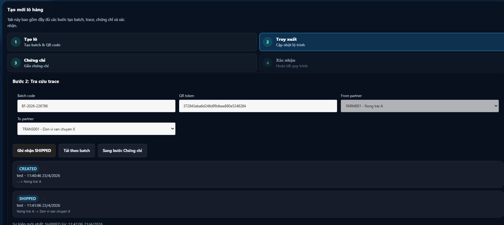
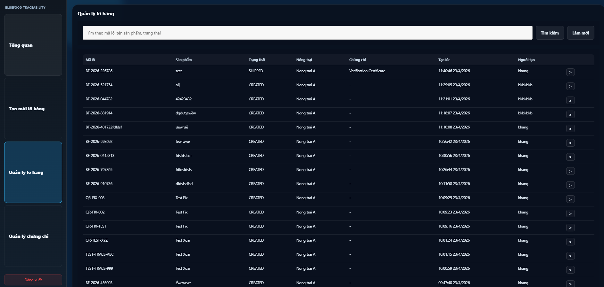

# BlueFood Frontend

Frontend React + TypeScript cho hệ thống truy xuất nguồn gốc BlueFood.

## Tính năng chính
- Dashboard tổng quan
- Tạo lô hàng, sinh QR code
- Cập nhật lộ trình (trace)
- Gán chứng chỉ cho lô hàng
- Quản lý lô hàng, chứng chỉ
- Truy xuất công khai qua QR

## Giao diện mẫu

### Đăng ký


### Đăng nhập


### Dashboard


### Tạo lô hàng


### Truy xuất lô hàng


### Gán chứng chỉ


### Xem danh sách chứng chỉ


### Quản lý lô hàng


### Xem chi tiết 1 lô


### Xác nhận lô


## Cài đặt & chạy
1. Cài đặt:
	```bash
	npm install
	```
2. Chạy dev:
	```bash
	npm run dev
	```
3. Build production:
	```bash
	npm run build
	npm run preview
	```

## Cấu hình API
- Sửa file `.env` từ mẫu `.env.example`:
  ```env
  VITE_API_BASE_URL=http://localhost:5085
  ```

## Liên kết nhanh
- Frontend: http://localhost:5173
- Swagger backend: http://localhost:5085/swagger
- Truy xuất công khai: http://localhost:5085/t/{qrToken}

## Lưu ý
- Hiển thị thời gian theo giờ Việt Nam (UTC+07:00).
- Nếu chạy frontend ở domain/port khác, cần cập nhật CORS backend.
